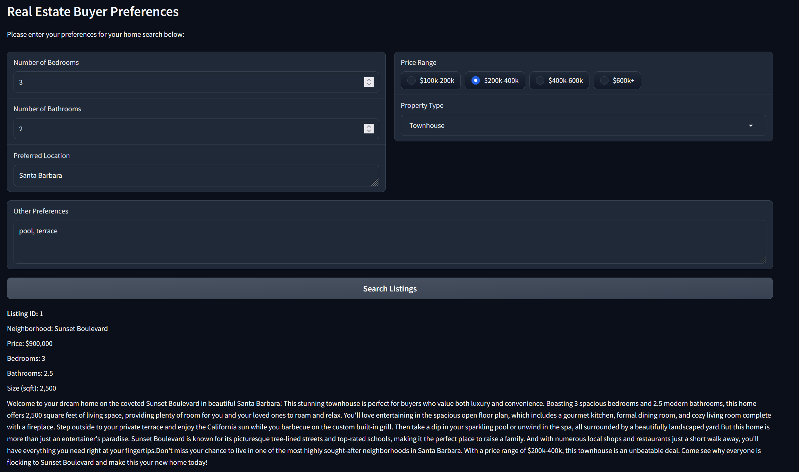

# Project: Personalized Real Estate Agent

## Introduction
Personalized Real Estate Agent, powered by generative AI, revolutionizes the traditional approach to property buying and selling by offering tailor-made solutions to individual clients. This innovative technology utilizes advanced algorithms to analyze vast datasets, including client preferences, market trends, and property features, to generate highly personalized recommendations. By understanding each client's unique needs and desires, the Personalized Real Estate Agent optimizes the search process, presenting curated listings that closely match their criteria. Furthermore, it offers virtual property tours, predictive pricing models, and personalized investment advice, enhancing the overall real estate experience. Beyond catering to individual buyers and sellers, this technology also finds application in property management, urban planning, and real estate investment analysis, showcasing its versatility and potential impact across various fields within the real estate industry.

## Project Summary
The "HomeMatch" project at "Future Homes Realty" aims to revolutionize the real estate industry by offering a personalized experience for clients during the property search process. The project focuses on leveraging advanced technologies to understand buyer preferences, match them with suitable property listings, and generate personalized descriptions tailored to individual needs. 

The core components of "HomeMatch" include:

1. **Understanding Buyer Preferences**: Clients input their requirements and preferences, which are interpreted by large language models (LLMs) to understand nuanced requests beyond basic filters.

2. **Integrating with a Vector Database**: The application connects with a vector database containing property listings. Vector embeddings are used to match properties with buyer preferences, considering aspects like location, amenities, architectural style, and neighborhood vibes.

3. **Personalized Listing Description Generation**: Using LLMs, the application rewrites property descriptions to highlight features most relevant to the buyer’s preferences. Personalization emphasizes characteristics that appeal to the buyer while ensuring factual accuracy about the property.

4. **Listing Presentation**: The personalized listing(s) are presented as text descriptions, providing a tailored narrative that resonates with the buyer's unique needs and preferences.

By combining advanced technologies like LLMs and vector databases, "HomeMatch" aims to create a more engaging and tailored experience for clients, enhancing customer satisfaction and revolutionizing the real estate industry's approach to property search.

# Implementation
The implementation of the "HomeMatch" application has involved the utilization of various tools and technologies to ensure efficient generation, storage, and presentation of real estate listings tailored to user preferences.

* To generate realistic and compelling real estate listings, we utilized the OpenAI API, leveraging its advanced natural language processing capabilities. This enabled us to create diverse property descriptions that encompassed key details such as neighborhood, price, bedrooms, bathrooms, and house size, providing users with comprehensive insights into each listing.

* For the storage and retrieval of real estate listings, we opted for ChromaDB, a vector database package compatible with Python. ChromaDB facilitated efficient storage of property embeddings generated from the listing descriptions, allowing for fast and accurate retrieval based on user preferences.

* To interface with users and collect their preferences, we developed a frontend application using Gradio. Gradio provided a user-friendly interface for users to input their preferences, guiding them through a series of questions or allowing them to express their preferences in natural language. This streamlined the process of gathering user requirements and ensured a seamless user experience.

Here's a summary of its main functionalities:

* `helper.py` provides several functions designed to assist in various tasks related to the "HomeMatch" application, such as 

    1. Generating real estate listings:
    - The `generate_single_listing` function generates a single real estate listing using OpenAI's GPT-3.5-turbo-instruct model. It takes a listing ID as input and returns a dictionary representing the generated listing.
    - The `generate_listings` function generates multiple real estate listings by calling `generate_single_listing` for each listing ID and saves the listings to a JSON file.

    2. Reading and processing listings:
    - The `read_from_file` function reads listings from a JSON file and returns them as a dictionary.
    - The `process_listings` function processes the listings and stores them in a ChromaDB database. It combines the house and neighborhood preferences into a single document content and extracts metadata for each listing.

    3. Querying and personalizing listings:
    - The `extract_price_range` function extracts the minimum and maximum price range from a given price range string.
    - The `query_listings` function queries the ChromaDB database for real estate listings based on specified criteria such as bedrooms, bathrooms, location, price range, property type, and other preferences.
    - The `personalize_listing` function personalizes a real estate listing description based on buyer preferences using OpenAI's GPT-3.5-turbo-instruct model.

    4. Generating HTML for listings:
    - The `generate_listing_html` function generates HTML code for a single real estate listing, including the personalized description.
    - The `get_personalized_listings` function retrieves personalized real estate listings based on specified criteria and returns the HTML code containing the personalized listings.

* `HomeMatch.ipynb`: This IPython Notebook helps to generate, process, and present real estate listings using the OpenAI API, saving the generated information in a vector database via ChromaDB and runs a Gradio interface for personalized real estate listings through the "HomeMatch" application. 
* `app.py` serves simple Gradio interface for personalized real estate listings based on user input ("HomeMatch" application).

Through the integration of these technologies, an end-to-end solution has been created that delivers personalized real estate recommendations based on user preferences. This approach enhances the overall user experience and facilitates informed decision-making in the homebuying process.